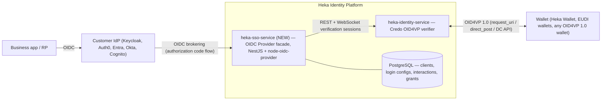
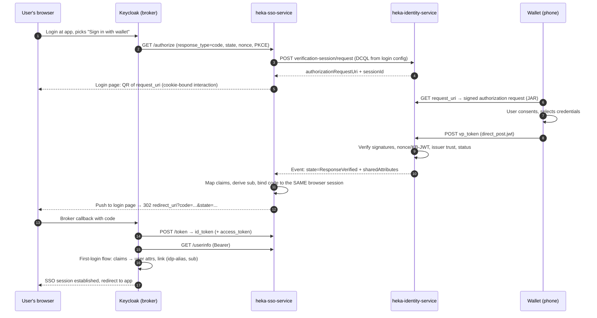

# Feasibility & High-Level Design

**Heka Identity Platform** · Draft v0.1 · 2026-08-12

An OIDC/OAuth 2.0 provider component that authenticates users by **Verifiable Credential presentation** instead of login/password, so that any IdP supporting custom OIDC providers (Keycloak, Auth0, Entra External ID, Okta, Cognito) can offer "Sign in with your wallet" through standard identity brokering.

---

## 1\. Verdict

**Feasible, and well-timed.** The recommendation is to build a new, separate component — working name **`heka-sso-service`** — that exposes a standard OIDC Authorization Server surface and internally drives Heka's existing OpenID4VP verification sessions.

| Factor | Assessment |
| --- | --- |
| Core verification capability | **Already built.** `heka-identity-service` has a complete OID4VP verifier (Credo-TS 0.7): authorization request creation with DCQL or Presentation Exchange, `direct_post` / `direct_post.jwt` response handling, Digital Credentials API support, and attribute extraction for SD-JWT VC, W3C VC-JWT, and mdoc. |
| Missing piece | An OIDC provider facade: `/authorize` , `/token` , discovery, JWKS, id\\_token minting, claim mapping. This is well-understood, library-supported territory. |
| Standards timing | OID4VP 1.0 is **Final** (July 2025), HAIP 1.0 Final (Dec 2025), DCQL replaced Presentation Exchange, and the browser Digital Credentials API shipped in Chrome 141 / Safari 26. Building now means building on final specs. |
| Pattern risk | **Low — the pattern is proven.** BC Gov's `vc-authn-oidc` has run this exact architecture in production for years (on the older DIDComm stack); Procivis, Gataca, and Talao sell it commercially; GAIA-X published an open-source prototype. |
| Market gap | No mature **open-source** bridge exists on **final OID4VP 1.0** . Existing OSS is either legacy-protocol ( `vc-authn-oidc` \\= DIDComm/AnonCreds, no PKCE) or prototype-grade (GAIA-X bridge, draft-18). Heka can fill this gap. |
| Roadmap fit | Heka's `[ROADMAP.md](http://roadmap.md/)` already lists **"SSO via SSI support + WebUI demo" for Q3 2026** . |
| Keycloak-native alternative | Keycloak core has OID4VCI (issuance) only; maintainers stated OID4VP login is **not** on their capacity roadmap — which validates the external-bridge approach. |

---

## 2\. Background

### 2.1 The problem

Organizations run IdPs (Keycloak et al.) that authenticate with passwords/OTP. SSI wallets hold verifiable credentials that could serve as phishing-resistant, attribute-rich login credentials — but IdPs speak OIDC, not OID4VP. The bridge translates between them:

-   **Upstream (towards the IdP):** a plain, spec-compliant OIDC provider — authorization code flow, discovery document, signed id\_tokens. The IdP needs zero SSI awareness.
-   **Downstream (towards the wallet):** OpenID4VP 1.0 — present a QR code / deep link / browser DC API prompt, receive and verify a `vp_token`, extract disclosed attributes.

The bridge's job is mapping a **synchronous redirect protocol** (OIDC code flow) onto an **asynchronous wallet interaction** (scan → present → verify), then minting an id\_token whose claims come from the verified credential.

### 2.2 What Heka already provides

| Needed capability | Existing Heka asset |
| --- | --- |
| Create OID4VP authorization requests (DCQL or PE, signed/unsigned, `direct_post(.jwt)` , `dc_api(.jwt)` ) | `heka-identity-service` — `POST /openid4vc/verification-session/request` ( `src/openid4vc/verification-sessions/` ) |
| Host wallet-facing OID4VP endpoints ( `request_uri` , `response_uri` ) | Credo public router at `:3003/oid4vp` ( `src/openid4vc/starter/` , `src/config/agent.ts` ) |
| Verify presentations & extract disclosed attributes | Verification session service — poll `GET /verification-session/:id` until `ResponseVerified` ; `extractAttributesFromPresentation` covers SD-JWT VC, JWT-VC, mdoc |
| Browser-mediated same-device flow | Digital Credentials API support — `POST /verification-session/:id/verify` with origin binding ( `docs/[dc-api.md](http://dc-api.md/)` ) |
| Async completion signals | Webhooks + WebSocket subscriptions ( `src/user/` module) |
| Declarative "what to ask for" | Verification templates ( `src/verification-template/` ) |
| Multi-tenancy | Credo tenants, auto-provisioned per `(role, sub, org_id)` |
| First-party wallet for demos/e2e | `heka-wallet` (Bifold fork) with OID4VP + DC API handlers |
| Working precedent in-repo | `demo/a2a-oid4vp` — OID4VP used as authentication for A2A agents |

What does **not** exist anywhere in the codebase: an `/authorize` endpoint, an OIDC discovery document, id\_token issuance, SIOPv2. The existing `heka-auth-service` is a username/password JWT issuer (shared-secret HS256), not an OIDC provider — it is not a suitable base for a public-facing, spec-compliant AS (different token model, different security posture), which is why a **new component** is recommended.

### 2.3 Standards to build on (state as of mid-2026)

| Spec | Status | Decision |
| --- | --- | --- |
| **OID4VP 1.0** | OpenID **Final** (2025-07-09) | Core wallet protocol. Use **DCQL** (PE was removed from the final spec); `request_uri` (JAR) for cross-device; `direct_post.jwt` responses. |
| **HAIP 1.0** | OpenID Final (2025-12) | Target profile for interop (SD-JWT VC + mdoc, encrypted responses, x509 client identification, DCQL). Required for EUDI-wallet compatibility. |
| **Digital Credentials API** | Chrome 141 & Safari 26 shipped; W3C WD on Rec track | **Preferred invocation channel** — the browser binds the request to origin + session, eliminating cross-device session fixation. QR is the fallback. |
| **SIOPv2** | Still Implementer's Draft; ecosystems moved to plain `vp_token` | **Skip.** |
| **SD-JWT** / SD-JWT VC | RFC 9901 / I-D (de-facto EUDI PID format) | First-priority credential format. |
| **W3C VC 2.0** | W3C Recommendation (2025-05) | Supported via existing Credo verification. |
| **ISO mdoc/mDL** | 18013-5/-7; OID4VP `mso_mdoc` profile | Supported via existing Credo verification. |
| AnonCreds | DIDComm-only in Heka (no OID4VP binding) | **Out of scope for v1** (possible later via a DIDComm present-proof channel, as `vc-authn-oidc` does). |

### 2.4 Prior art (what to learn from)

| Project | Stack | Takeaway |
| --- | --- | --- |
| [`acapy-vc-authn-oidc`](https://github.com/openwallet-foundation/acapy-vc-authn-oidc) (BC Gov → OWF) | FastAPI OP + ACA-Py, DIDComm/AnonCreds | The canonical architecture: park the OIDC request server-side, QR page with [socket.io](http://socket.io/) push + polling fallback, webhook-driven completion, configurable `sub` strategies (nominated attribute / ephemeral / consistent hash), `vc_presented_attributes` claim, `amr=vc_authn` . Its debt list (no OID4VP, no SD-JWT, no PKCE) is exactly what a new build fixes. |
| [GAIA-X `ssi-to-oidc-bridge`](https://github.com/GAIA-X4PLC-AAD/ssi-to-oidc-bridge) | Ory Hydra + Next.js login app | "Don't hand-roll the OP" — delegate OIDC correctness to a certified OP core and implement only the login interaction. JSONPath-based declarative "login policies" for issuer allowlists + claim mapping. |
| [Procivis One OpenID Bridge](https://docs.procivis.ch/openid-bridge/integrate) | Commercial, Rust core | Validates the exact product shape, with Keycloak as the documented primary integration; `{schema}--{path}` claim mapping, holder identifier as default `sub` . |
| [`ba-itsys/keycloak-extension-oid4vp`](https://github.com/ba-itsys/eudi-wallet-connector) | Keycloak IdP SPI | Proves the Keycloak-native alternative works (OIDF-conformant, in Germany's SPRIND EUDI sandbox) — a reference if a Keycloak-embedded variant is ever demanded. |
| [EUDI verifier endpoint](https://github.com/eu-digital-identity-wallet/eudi-srv-web-verifier-endpoint-23220-4-kt) | Kotlin/Spring | Reference for `response_code` \\-style completion binding and delegated issuer-trust validation. |
| [interID paper](https://arxiv.org/html/2602.14871) (2026) | Academic, Keycloak-based VaaS | Security checklist: 11 attack vectors at the OIDC/SSI/multi-tenant seam; critique of `vc-authn-oidc` and [walt.id](http://walt.id/) IDP Kit. Use as the threat-model starting point. |

---

## 3\. High-level design

### 3.1 Topology decision: standalone bridge, not a Keycloak plugin

| Column 1 | A. Standalone OIDC provider (recommended) | B. Keycloak SPI extension |
| --- | --- | --- |
| IdP coverage | Any IdP with OIDC brokering (Keycloak, Auth0, Entra, Okta, Cognito) + any plain OIDC RP directly | Keycloak only |
| Coupling | Standard protocol boundary; zero IdP-version coupling | Compiled against Keycloak internals; re-verify ~3 majors/year |
| Fit with Heka | Matches the polyrepo component pattern ( `heka-*-service` ); TypeScript/NestJS like the rest | Java, foreign to the codebase |
| Ops | One more service to run (it's an internet-facing AS) | Ships inside Keycloak |

Path A also serves non-brokered use: any application that speaks OIDC can point directly at the bridge without an intermediary IdP. Path B remains open later — the `ba-itsys` extension shows the shape — but A is the strategic choice and matches the "provider component usable by IDPs that support custom providers" goal verbatim.

### 3.2 Component architecture

New component `heka-sso-service` (NestJS, Node 22, TypeScript — consistent with the platform):

  

**Internal structure:**

1.  **OP core** — [`node-oidc-provider`](https://github.com/panva/node-oidc-provider) (OpenID-certified, actively maintained, TypeScript-friendly, embeds cleanly in NestJS). It supplies spec-correct `/authorize`, `/token`, `/jwks`, `/userinfo`, discovery, session management, PKCE, logout — so Heka only implements the _interaction_ (login) layer. This is the GAIA-X "delegate OIDC correctness" lesson, without the operational cost of running Ory Hydra as a second product.
2.  **Interaction service** — implements `node-oidc-provider`'s interaction hook: creates a verification session in `heka-identity-service`, renders the login page (DC API button on capable browsers, QR + deep link otherwise), listens for completion (WebSocket subscription to Identity Service events, polling fallback), then resolves the interaction with the mapped account.
3.  **Login configurations** (declarative, stored in Postgres, CRUD via admin API):
    -   reference to a **verification template** / DCQL query (which credentials, which claims, issuer constraints);
    -   **claim mapping**: DCQL credential-query id + claim path → OIDC claim name (e.g. `pid.given_name → given_name`), plus static claims;
    -   **`sub` strategy** (see 3.5) and trust policy (accepted issuers/trust anchors, revocation policy);
    -   selected per OIDC client (default config) or per request via a `login_config:<id>` scope value — Keycloak's per-IdP "Default Scopes" setting carries this cleanly.
4.  **Admin API** — manage OIDC clients (the IdPs) and login configurations; later surfaced in `heka-identity-service-web-ui`.
5.  **Storage** — PostgreSQL via MikroORM (platform standard) for clients, configs, interactions, codes/grants, and key material.

### 3.3 Authentication flow (cross-device)

**Same-device / DC API variant:** the login page calls `navigator.credentials.get()` with the OID4VP request (Chrome 141+, Safari 26+); the browser brokers wallet selection and returns the response, which the page submits to `POST /verification-session/:id/verify` (origin-bound, already implemented in Heka). Synchronous, no QR, immune to session fixation by construction. The login page feature-detects and prefers DC API, falling back to QR/deep link.

**Critical binding rule:** the authorization code is released **only into the browser session that initiated `/authorize`** (interaction cookie), never into the wallet's return channel. The wallet's `direct_post` response resolves the _verification session_; the browser learns of completion via push/poll and redeems it. A fresh per-transaction `nonce` is verified inside the SD-JWT VC Key-Binding JWT / mdoc `deviceAuth`, binding holder-key possession to this exact request.

### 3.4 The OIDC surface the bridge must expose

The common denominator across Keycloak, Auth0, Entra External ID, Okta, and Cognito (each verified against current docs/source):

| Requirement | Detail |
| --- | --- |
| Discovery | `{issuer}/.well-known/openid-configuration` with `issuer` (exact-match, https, no query/fragment), `authorization_endpoint` , `token_endpoint` , `jwks_uri` , `response_types_supported` ( `code` ), `subject_types_supported` ( `public` ), `token_endpoint_auth_methods_supported` , `id_token_signing_alg_values_supported` |
| Flow | Authorization code, `response_mode=query` . **No PAR/JAR requirement** — Keycloak's broker cannot send them; PKCE **S256 accepted** (Keycloak opt-in, others expect it) |
| `state` | Echo verbatim; Keycloak's state is long (>100 chars) — **no length limits** |
| `nonce` | Keycloak always sends one and **hard-fails** if the id\\_token doesn't echo it |
| id\\_token | JWS **RS256** default (+ ES256 option), `kid` in header and JWKS (Cognito requires it), `iss` \\=issuer, `aud` \\=client\\_id, stable `sub` , `exp` / `iat` (mind Keycloak's default **0s clock skew** — back-date `iat` slightly), `sid` for logout, profile claims incl. `email` + `email_verified` (Entra/Okta functionally require email; pair with Keycloak "Trust Email") |
| Token endpoint auth | **Both** `client_secret_post` (Cognito/Entra floor) and `client_secret_basic` ; `private_key_jwt` as an option |
| userinfo | JSON over Bearer GET, `Content-Type: application/json` , **`sub` identical to id\\_token** (Keycloak verifies) |
| Logout | `end_session_endpoint` honoring `id_token_hint` + `post_logout_redirect_uri` ; emit OIDC Back-Channel Logout tokens ( `sid` \\-matched) to Keycloak's `/logout/backchannel-logout` |
| Auth0 quirk | Auth0 doesn't call userinfo — all needed claims must be in the id\\_token |
| TLS | Public-CA HTTPS on 443 (Cognito requirement; private CAs need Keycloak truststore config) |

`node-oidc-provider` covers essentially all of this out of the box; the checklist becomes configuration + conformance testing rather than implementation.

### 3.5 Identity mapping

**Subject identifier (`sub`) — configurable per login configuration:**

| Strategy | Behavior | Use when |
| --- | --- | --- |
| `credential-claim` | A nominated claim (e.g. personal ID number, employee ID) | The credential carries a stable unique identifier and its disclosure is acceptable |
| `derived` ( **default** ) | `HMAC(salt, client_id ‖ stable-claim-set)` — stable _and_ pairwise per RP | Privacy-preserving stable login (mirrors OIDC pairwise subs; `vc-authn-oidc` 's "consistent identifier") |
| `ephemeral` | Random per session | Pure attribute-gating (e.g. age check), no account continuity |

Do **not** default to holder DID / key-binding key as `sub`: SD-JWT VC key-binding keys rotate per credential and EUDI PIDs have no stable holder key — logins would silently become new users.

**Claims:** mapped claims land as standard OIDC claims (per login config); the full disclosed set is additionally available under a namespaced `vc_presented_attributes` claim; `amr` is set (e.g. `["vc"]`) and the login config id is echoed in a custom claim so downstream policy can tell _how_ and _with what_ the user authenticated. On the Keycloak side, identity-provider mappers (Attribute Importer etc., sync mode `force`) turn these into user attributes/roles; the federated identity link is `(idp-alias, sub)`.

**Account model in Keycloak:** default first-broker-login flow (create-on-first-login, email-collision linking) works unchanged. Transient users are possible but still an experimental Keycloak feature — don't depend on it.

### 3.6 Security design

1.  **Cross-device session fixation** (the defining attack: attacker relays a legit QR to a victim): prefer **DC API** (origin+session binding by the browser); for the QR path follow the [IETF Cross-Device Flows BCP](https://datatracker.ietf.org/doc/html/draft-ietf-oauth-cross-device-security) — short request TTLs (≤2–3 min), display verifier identity/origin in the wallet consent (signed request with `x509_san_dns` client id per HAIP), one-time `request_uri`, and never auto-redirect on a session the user didn't initiate.
2.  **Response confidentiality/replay:** `direct_post.jwt` (encrypted responses) per HAIP; single-use verification sessions; nonce verified in KB-JWT/`deviceAuth`.
3.  **Trust framework:** per-login-config issuer allowlists / trust anchors (x5c chains, later trusted lists / OpenID Federation). Never a global hardcoded trust store.
4.  **Revocation:** check Token Status List (SD-JWT VC), Bitstring Status List (W3C VC), MSO validity (mdoc); per-config policy hard-fail vs. flag; cache status lists.
5.  **OAuth hygiene:** PKCE, exact redirect URI matching, one-time codes bound to client + interaction cookie, rotating asymmetric signing keys (`kid` discipline), rate limiting on `/authorize` and the interaction endpoints. Use interID's 11-vector analysis as the threat-model checklist; run the OIDF conformance suite before release.
6.  **Key hygiene (platform-wide caveat):** the repo currently ships dev secrets as defaults; the bridge must generate its keys on first start and refuse known-default secrets in production mode.

---

## 4\. Implementation plan

### Phase 1 — MVP (bridge works end-to-end with Keycloak)

-   `heka-sso-service` skeleton: NestJS + `node-oidc-provider` \+ MikroORM/Postgres, Dockerfile, docker-compose, CI workflow (copy the existing component pattern).
-   Discovery, `/authorize`, `/token`, `/jwks`, `/userinfo`; code flow + PKCE; RS256/ES256 with rotation.
-   Interaction page: QR + deep link, polling for completion; verification via Identity Service REST API; SD-JWT VC only.
-   Login configurations as static config (JSON/env), `derived` sub strategy, basic claim mapping.
-   Keycloak demo: compose file with a realm pre-configured to broker to the bridge (+ mappers), demo walkthrough with `heka-wallet`. This also delivers the roadmap's "WebUI demo".

### Phase 2 — Product-grade UX & management

-   DC API same-device flow (reuse the existing `verify` endpoint); WebSocket push to the login page.
-   Admin CRUD for OIDC clients + login configurations; WebUI screens; per-scope config selection.
-   mdoc + W3C VC-JWT formats; `email_verified` handling; RP-initiated + back-channel logout; multiple `sub` strategies.
-   E2E tests (existing Vitest/e2e patterns), threat-model review against interID's checklist.

### Phase 3 — Interop & assurance

-   HAIP 1.0 profile: signed requests with `x509_san_dns`, `direct_post.jwt` encrypted responses, DCQL-only.
-   Revocation/status-list policies; per-config trust anchors; EUDI reference wallet interop testing.
-   OIDF conformance testing (OP certification + OID4VP conformance); brokering guides for Auth0/Entra/Okta/Cognito; multi-tenant bridge (per-tenant issuers) if demanded.

Rough sizing: Phase 1 is a few engineer-weeks given how much the verifier stack already covers; Phases 2–3 are comparable increments each. The dominant unknowns are wallet-interop debugging and conformance-suite fixes, not core construction.

---

## 5\. Risks & open questions

| # | Risk / question | Mitigation / next step |
| --- | --- | --- |
| 1 | **Credo OID4VP-final coverage** — Heka pins Credo-TS 0.7 ( `v1` / `v1.draft21` request versions). Exact conformance of Credo's "v1" to the published Final (and its DCQL coverage) must be verified against real wallets. | Early spike: run the OIDF OID4VP conformance tests against a Heka verification session; track Credo releases. |
| 2 | **Wallet ecosystem variance** — EUDI wallets require HAIP + (per eIDAS 2.0) relying-party registration in national registries; other wallets vary in DCQL/ `direct_post.jwt` support. | Ship draft/profile compatibility switches per login config (Heka's session API already exposes version + response-mode knobs); test matrix: Heka Wallet, EUDI reference wallet, Sphereon/Animo wallets, Talao Altme. |
| 3 | **`sub` stability across credential re-issuance** — users re-issued a credential must not become new accounts. | Default `derived` strategy over stable _claims_ , not keys/DIDs; document the constraint per credential type. |
| 4 | **DC API maturity** — Firefox support is new; enterprise browsers lag. | Always ship the QR fallback; feature-detect. |
| 5 | **AnonCreds credentials can't ride OID4VP** — Heka's AnonCreds flows are DIDComm-only. | Explicitly out of scope for v1; optional later: a DIDComm present-proof channel in the interaction service (vc-authn parity). |
| 6 | **Bridge is an internet-facing AS** — new attack surface for the platform. | Certified OP library, conformance testing, security review before GA; no default secrets. |
| 7 | Where does the bridge live — new component vs. extending `heka-auth-service` ? | Recommended: new component (auth-service is a shared-secret HS256 password service; mixing postures invites mistakes). Revisit only if ops overhead is a blocker. |

---

## 6\. Keycloak integration recipe (target UX)

1.  Deploy `heka-sso-service`; create an OIDC client for the realm (`client_id`, secret, redirect URI `https://{kc}/realms/{realm}/broker/{alias}/endpoint`); attach a login configuration (e.g. "PID: given\_name, family\_name, birthdate").
2.  Keycloak → Identity Providers → **OpenID Connect v1.0** → paste the bridge's discovery URL → set client credentials (`client_secret_post` or `basic`), enable PKCE (S256), optionally "Trust Email".
3.  Add identity-provider mappers: Attribute Importer for `given_name`/`family_name`/etc., sync mode `force`; optionally Advanced Claim → Role from `vc_presented_attributes`.
4.  First-broker-login flow: default (auto-create users) or "Detect Existing Broker User" for pre-registered-only populations.
5.  The realm's login page now shows "Sign in with wallet" alongside password login — zero changes to downstream applications.

---

## 7\. References

-   OID4VP 1.0 (Final): [https://openid.net/specs/openid-4-verifiable-presentations-1\_0.html](https://openid.net/specs/openid-4-verifiable-presentations-1_0.html)
-   HAIP 1.0 (Final): [https://openid.net/specs/openid4vc-high-assurance-interoperability-profile-1\_0.html](https://openid.net/specs/openid4vc-high-assurance-interoperability-profile-1_0.html)
-   W3C Digital Credentials API: [https://www.w3.org/TR/digital-credentials/](https://www.w3.org/TR/digital-credentials/)
-   SD-JWT: RFC 9901 · SD-JWT VC: draft-ietf-oauth-sd-jwt-vc · W3C VC 2.0: [https://www.w3.org/TR/vc-data-model-2.0/](https://www.w3.org/TR/vc-data-model-2.0/)
-   IETF Cross-Device Flows BCP: [https://datatracker.ietf.org/doc/html/draft-ietf-oauth-cross-device-security](https://datatracker.ietf.org/doc/html/draft-ietf-oauth-cross-device-security)
-   `acapy-vc-authn-oidc` (OWF): [https://github.com/openwallet-foundation/acapy-vc-authn-oidc](https://github.com/openwallet-foundation/acapy-vc-authn-oidc)
-   GAIA-X ssi-to-oidc-bridge: [https://github.com/GAIA-X4PLC-AAD/ssi-to-oidc-bridge](https://github.com/GAIA-X4PLC-AAD/ssi-to-oidc-bridge)
-   Procivis OpenID Bridge: [https://docs.procivis.ch/openid-bridge/integrate](https://docs.procivis.ch/openid-bridge/integrate)
-   ba-itsys Keycloak OID4VP extension: [https://github.com/ba-itsys/eudi-wallet-connector](https://github.com/ba-itsys/eudi-wallet-connector) · Keycloak OID4VP discussion: [https://github.com/keycloak/keycloak/discussions/47346](https://github.com/keycloak/keycloak/discussions/47346)
-   EUDI verifier endpoint: [https://github.com/eu-digital-identity-wallet/eudi-srv-web-verifier-endpoint-23220-4-kt](https://github.com/eu-digital-identity-wallet/eudi-srv-web-verifier-endpoint-23220-4-kt)
-   interID (attack-vector analysis): [https://arxiv.org/html/2602.14871](https://arxiv.org/html/2602.14871)
-   Keycloak identity brokering: [https://www.keycloak.org/docs/latest/server\_admin/index.html#\_identity\_broker](https://www.keycloak.org/docs/latest/server_admin/index.html#_identity_broker)
-   `node-oidc-provider` (certified OP): [https://github.com/panva/node-oidc-provider](https://github.com/panva/node-oidc-provider)
-   Heka Identity Platform: [https://github.com/hiero-ledger/heka-identity-platform](https://github.com/hiero-ledger/heka-identity-platform) (`heka-identity-service/src/openid4vc/`, `docs/[dc-api.md](http://dc-api.md/)`, `[ROADMAP.md](http://roadmap.md/)`)
