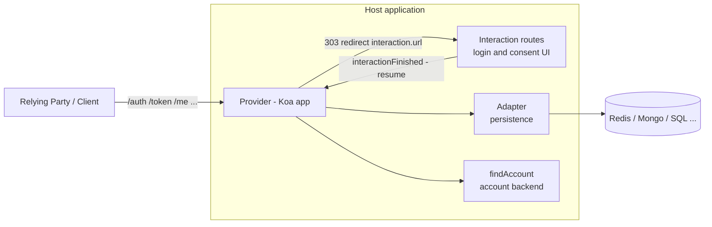

# node-oidc-provider — Architecture Overview

`oidc-provider` (v9.x) is a certified **OAuth 2.0 Authorization Server / OpenID Connect Provider (OP)** framework for Node.js. It is not a turnkey server: it implements the protocol endpoints, token lifecycle, and security profiles, and delegates **accounts, login UI, consent UI, and persistence** to the host application.

- Package: `oidc-provider`, pure **ESM** (`"type": "module"`), entry `lib/index.js`
- Runtime: **Node.js 22.x LTS or later** (warned at import time, `lib/index.js`)
- Only three runtime dependencies: `koa`, `jose`, `debug`
- Types: external, via `@types/oidc-provider` (DefinitelyTyped)

```
import Provider, { errors, interactionPolicy, ExternalSigningKey } from 'oidc-provider';
```

---

## 1. High-level design



The `Provider` class **extends Koa** (`lib/provider.js`). You either run it standalone (`provider.listen()`) or mount it into express/fastify/koa/hapi via `provider.callback()`. Everything protocol-related happens inside; the host app supplies four integration surfaces:

| Surface | What you provide |
|---|---|
| **Configuration** | One big options object (`lib/helpers/defaults.js` is the source of truth and the generated docs) |
| **Adapter** | Persistence for tokens/sessions/etc. (contract in `example/my_adapter.js`) |
| **`findAccount`** | Resolves an `accountId` to claims for ID Tokens / userinfo |
| **Interactions** | Your own login & consent pages, wired via `interactionDetails` / `interactionFinished` |

---

## 2. Repository layout

| Path | Purpose |
|---|---|
| `lib/` | The entire published library (`"files": ["lib"]`) |
| `example/` | Reference apps: `express.js`, `koa.js`, `standalone.js`, interaction routing in `example/routes/`, adapter contract in `example/my_adapter.js` |
| `docs/README.md` | Full API + configuration reference (config section auto-generated from JSDoc in `lib/helpers/defaults.js` by `docs/update-configuration.js`) |
| `docs/events.md` | Provider event table |
| `test/` | ~60 mocha suites by feature area, run against a live HTTP server; re-runnable mounted under express/koa/fastify/hapi (`MOUNT_VIA`) |
| `certification/` | OpenID Foundation conformance-suite runners (OIDC + FAPI) — explicitly *not* example code |
| `tools/` | Build scripts: `build.js` (publishable `dist/`), `build-views.js` (pre-compiles Eta templates into `lib/views/`) |

Former dependencies are deliberately in-lined with parity tests: router (`lib/helpers/router.js` replaces `@koa/router`), templates (pre-compiled `lib/views/*.js` replace runtime `eta`), lodash subset (`lib/helpers/_/`).

---

## 3. `lib/` internals

### 3.1 The Provider class (`lib/provider.js`)

`new Provider(issuer, configuration)`:

1. Validates the issuer URL, calls the Koa constructor.
2. `new Configuration(setup)` (`lib/helpers/configuration.js`) merges user config with `lib/helpers/defaults.js`, validates it, and stores all private state in a WeakMap (`lib/helpers/weak_cache.js`) — internals never leak onto the public object.
3. Initialization chain: `initializeAdapter` → `initializeKeystore` (JWKS) → `initializeApp` (builds router + middleware graph) → `initializeClients` (static clients).

Key public API:

- `provider.listen()` / `provider.callback()` — standalone or mountable handler
- `provider.interactionDetails(req, res)` / `interactionResult(...)` / `interactionFinished(...)` — interaction handoff
- `provider.registerGrantType(name, handler, params)` / `registerResponseMode(name, handler)` — extension points
- `provider.backchannelResult(...)` — CIBA completion
- `provider.use(fn)` — user middleware, always spliced *before* internal handlers (pre/post processing)
- `Provider.ctx` — current Koa `ctx` from anywhere via AsyncLocalStorage (`lib/helpers/als.js`)
- Per-instance model getters: `provider.AccessToken`, `provider.Grant`, `provider.Session`, `provider.Client`, … (model classes are factories closed over the provider instance)
- Standard `EventEmitter` interface for all lifecycle events

### 3.2 Actions — endpoints (`lib/actions/`)

Each endpoint is a composed stack of small Koa middlewares. Default routes (all configurable via `routes`):

| Route | Default path | Handler |
|---|---|---|
| authorization | `/auth` | `lib/actions/authorization/` |
| token | `/token` | `lib/actions/token.js` |
| userinfo | `/me` | `lib/actions/userinfo.js` |
| jwks | `/jwks` | `lib/actions/jwks.js` |
| discovery | `/.well-known/openid-configuration` | `lib/actions/discovery.js` |
| registration | `/reg` | `lib/actions/registration.js` |
| revocation / introspection | `/token/revocation`, `/token/introspection` | `lib/actions/{revocation,introspection}.js` |
| end_session | `/session/end` | `lib/actions/end_session.js` |
| device_authorization / code_verification | `/device/auth`, `/device` | device flow |
| pushed_authorization_request | `/request` | PAR |
| backchannel_authentication | `/backchannel` | CIBA |
| credential, challenge | `/credential`, `/challenge` | OpenID4VCI (experimental) |

**The authorization pipeline** (`lib/actions/authorization/index.js`) is the architectural centerpiece: one factory assembles a different middleware array per endpoint kind (authorization, resume, device authorization, device resume, code verification, PAR, CIBA) from ~45 single-purpose step files (`check_pkce`, `check_prompt`, `load_account`, `load_grant`, `process_request_object`, `interactions`, `respond`, …).

**Grant types** (`lib/actions/grants/`), each exporting `{ handler, parameters, grantType }`:
`authorization_code`, `refresh_token`, `client_credentials`, `urn:ietf:params:oauth:grant-type:device_code`, `urn:openid:params:grant-type:ciba`, `urn:ietf:params:oauth:grant-type:pre-authorized_code`. Custom grants plug in via `provider.registerGrantType()`.

### 3.3 Models (`lib/models/`)

Every persistable artifact is a model class composed from mixins (`lib/models/mixins/`: `consumable`, `has_format`, `has_grant_id`, `is_sender_constrained`, `is_session_bound`, `stores_auth`, `stores_pkce`, …) on top of `BaseModel` → `BaseToken`:

- **Tokens**: `AccessToken`, `AuthorizationCode`, `RefreshToken`, `ClientCredentials`, `DeviceCode`, `BackchannelAuthenticationRequest`, `PreAuthorizedCode`, `InitialAccessToken`, `RegistrationAccessToken`
- **State**: `Session` (browser SSO session), `Interaction` (in-flight login/consent), `Grant` (what an account granted to a client: OIDC scopes/claims + per-resource scopes), `PushedAuthorizationRequest`, `ReplayDetection`
- **Non-persisted**: `Client` (schema-validated, static from config or dynamic via DCR + LRU cache), `IdToken` (signing/encryption only)

`BaseModel` provides `save()`, `destroy()`, `static find()`, and emits lifecycle events (`access_token.saved`, `authorization_code.consumed`, …). Token serialization formats: `opaque` (default) and RFC9068 `jwt`, selectable per resource server (`lib/models/formats/`).

### 3.4 Persistence — the Adapter contract

Adapter = a class (or factory) instantiated **once per model name**. Contract (`example/my_adapter.js`):

```js
class MyAdapter {
  constructor(name) {}                       // one of 15 model names below
  async upsert(id, payload, expiresIn) {}    // create-or-update, TTL in seconds
  async find(id) {}                          // → payload | undefined
  async findByUid(uid) {}                    // Session only
  async findByUserCode(userCode) {}          // DeviceCode only
  async consume(id) {}                       // mark consumed (find() then returns { ...payload, consumed })
  async destroy(id) {}                       // delete
  async revokeByGrantId(grantId) {}          // delete all artifacts of a grant
}
```

Model names: `Grant`, `Session`, `AccessToken`, `AuthorizationCode`, `RefreshToken`, `ClientCredentials`, `Client`, `InitialAccessToken`, `RegistrationAccessToken`, `DeviceCode`, `Interaction`, `ReplayDetection`, `BackchannelAuthenticationRequest`, `PreAuthorizedCode`, `PushedAuthorizationRequest`.

The default `lib/adapters/memory_adapter.js` is dev-only. Community adapters (Redis, MongoDB, SQL) are linked from `docs/README.md`. Payloads are open-ended — use a schemaless or JSON-capable store.

### 3.5 Helpers (`lib/helpers/`)

Highlights: `configuration.js` + `defaults.js` (config), `features.js` (stable vs experimental feature flags), `initialize_*.js` (bootstrap), `keystore.js` (JWKS + `ExternalSigningKey` for HSM/KMS), `interaction_policy/` (prompt engine), `oidc_context.js` (`ctx.oidc`), `errors.js` (all `OIDCProviderError` classes), `router.js`, `als.js`, `revoke.js` (cascading revocation).

### 3.6 Shared middleware (`lib/shared/`)

Cross-cutting Koa middleware: body parsing (`selective_body`), param assembly against an allow-list, client authentication (`client_auth`, JWT + attestation variants), session loading, bearer/DPoP access token validation, CORS presets (per-route, client-based via `clientBasedCORS`), CSRF, and the error handlers that translate exceptions into spec-compliant responses and emit `*.error` events.

---

## 4. Request lifecycle

1. Request hits the internal router (`lib/helpers/initialize_app.js`). Each route stack starts with `ensureOIDC`, which lazily creates `ctx.oidc = new OIDCContext(ctx)` and wraps downstream in AsyncLocalStorage.
2. `ctx.oidc` (`lib/helpers/oidc_context.js`) carries everything: `params`, `client`, `session`, `grant`, `account`, `entities`, `route`, `urlFor()`.
3. The endpoint-specific middleware stack runs (validation → client auth → business logic → respond).
4. Sessions touched during the request are persisted in a `finally` middleware; errors funnel through the shared error handlers.

### The interaction (login/consent) flow

1. `/auth` request is validated; the **interaction policy** (`interactionPolicy` export; default prompts `login` and `consent`, each a list of `Check`s) decides whether user interaction is needed.
2. If yes: an `Interaction` record is saved, interaction + resume cookies are set, and the user is 303-redirected to `interactions.url` (default `/interaction/:uid`) — **a route your app owns**.
3. Your app calls `provider.interactionDetails(req, res)`, renders login/consent, authenticates the user, builds/updates a `provider.Grant` (scopes + claims), and calls `provider.interactionFinished(req, res, { login: { accountId }, consent: { grantId } })`.
4. The user is redirected back to the resume route (`/auth/:uid`); the pipeline re-evaluates the policy and, when nothing is pending, issues the authorization response.

Reference implementations: `example/routes/express.js` and `example/routes/koa.js` (the koa one also demonstrates federated upstream login via `openid-client`). The built-in `features.devInteractions` (on by default) provides a throwaway dev UI — disable it in production.

---

## 5. Configuration surface (selected)

Everything is one options object; full reference in `docs/README.md` (generated from `lib/helpers/defaults.js`).

- **Must-touch for production**: `adapter`, `findAccount`, `jwks`, `clients` (or dynamic registration), `cookies.keys`, `interactions.url`, `features.devInteractions: false`, `renderError`, `ttl`
- **Identity**: `claims` (claim→scope mapping), `scopes`, `subjectTypes` / `pairwiseIdentifier`
- **Clients**: `clientDefaults`, `clientAuthMethods`, `extraClientMetadata`, `clientBasedCORS`
- **Tokens**: `ttl.*` (static or per-context functions), `formats` (opaque/JWT), `extraTokenClaims`, `issueRefreshToken`, `rotateRefreshToken`, `expiresWithSession`, `loadExistingGrant`, `revokeGrantPolicy`
- **Protocol**: `responseTypes`, `pkce` (required by default), `acrValues`, `extraParams`, `enabledJWA.*` (algorithm allow-lists), `clockTolerance`
- **Features** (`features.*`): stable — `devInteractions`, `userinfo`, `introspection`, `revocation`, `registration` + `registrationManagement` (DCR), `deviceFlow`, `clientCredentials`, `backchannelLogout`, `rpInitiatedLogout`, `ciba`, `dPoP`, `mTLS`, `pushedAuthorizationRequests` (PAR), `requestObjects` (JAR), `jwtResponseModes` (JARM), `jwtIntrospection`, `jwtUserinfo`, `resourceIndicators`, `encryption`, `fapi`, `claimsParameter`. Experimental (require version `ack`): `openid4vci`, `richAuthorizationRequests`, `attestClientAuth`, `clientIdMetadataDocument`, `webMessageResponseMode`, `externalSigningSupport`.

---

## 6. Events

The provider is an `EventEmitter` (full table in `docs/events.md`):

- Flow events: `authorization.accepted|success|error`, `interaction.started|ended`, `grant.success|error|revoked`, `pushed_authorization_request.success`, `device_authorization.success`, `end_session.success`, `backchannel.success|error`, `registration_create|update|delete.success`, `server_error`, plus `<route>.error` for every endpoint
- Model lifecycle: `<snake_case_kind>.saved|issued|consumed|destroyed` for every persisted model (e.g. `access_token.issued`, `refresh_token.consumed`, `session.destroyed`)

These are the natural hook points for audit logging, metrics, and token-issuance side effects.

---

## 7. Implemented specifications

OAuth 2.0 (RFC6749) + OIDC Core, Discovery (OIDC + RFC8414), Dynamic Client Registration (OIDC DCR, RFC7591/7592), RP-Initiated & Back-Channel Logout, Revocation (RFC7009), Introspection (RFC7662, RFC9701 JWT responses), PKCE (RFC7636), Native Apps BCP (RFC8252), Device Flow (RFC8628), mTLS (RFC8705), Resource Indicators (RFC8707), JAR (RFC9101), PAR (RFC9126), Issuer Identification (RFC9207), DPoP (RFC9449), JWT Access Tokens (RFC9068), JARM, CIBA, FAPI 1.0 Advanced & FAPI 2.0, and experimental OpenID4VCI / RAR (RFC9396) / Attestation-Based Client Auth.

OpenID-certified for the Basic, Implicit, Hybrid, Config, Form Post, 3rd-party-init profiles, both logout profiles, FAPI 1.0/2.0 and FAPI-CIBA.
