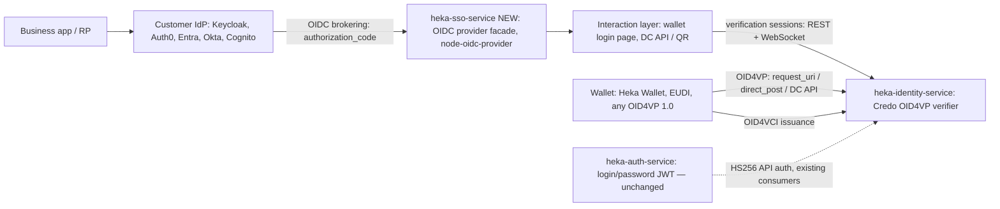

# Integration Notes — heka-sso-service on node-oidc-provider

Companion to [Architecture of oidc-provider.md](<Architecture of oidc-provider.md>) (library internals) and [Feasibility & High-Level Design.md](<../../docs/Feasibility & High-Level Design.md>) (product design, "the feasibility doc"). This document maps that design onto the platform and carries the implementation plan for the new service.

> **Platform decisions**
>
> 1. **heka-sso-service is a new, separate project** in this repository (a sibling of `heka-auth-service`, `heka-identity-service`, `heka-wallet`), exactly as the feasibility doc recommends (its Risk #7). The earlier idea of building the bridge inside heka-auth-service is **superseded**: an internet-facing, spec-compliant AS does not share a process, database, or security posture with the legacy password service.
> 2. **Clean separation of duties.** `heka-auth-service` stays what it is — **simple login/password** JWT issuance for its existing consumers (heka-identity-service API auth) — and is not modified by this plan. `heka-sso-service` handles **VC (wallet) login only**: a standard OIDC provider facade whose sole authentication method is OID4VP presentation. The two services share no code, no database tables, and no keys.
> 3. **No SSI logic in heka-sso-service.** All verification and issuance stays in heka-identity-service (Credo); the bridge orchestrates its **existing** verification-session API. `features.openid4vci` stays disabled — heka-identity-service is the platform's sole OID4VCI issuer and wallets interact with it directly.
>
> This document lives in `heka-sso-service/docs/` (moved here as part of the Phase 0 scaffold), together with the library architecture notes; the feasibility doc remains in the repo-root `docs/`.

Target topology:



---

## 1. IdP brokering (Keycloak first)

The IdP brokers logins to heka-sso-service: the bridge is the **external OIDC Identity Provider**, the IdP registers it and delegates authentication via the standard authorization code flow. Keycloak is the first-supported IdP; the OP surface targets the common denominator of Keycloak, Auth0, Entra External ID, Okta, and Cognito (feasibility §3.4).

### Steps on the bridge (OP side)

1. **Build a production-ready OP**
   - The service is a thin host around `new Provider('https://sso.example.com', config)` (`provider.callback()` mounted at the app root — the whole service *is* the OP, no path prefix needed).
   - Implement the **adapter** (contract in `example/my_adapter.js`), **`findAccount`**, and the **interaction routes** (wallet login UI).
   - Production config: `features.devInteractions: false`, real `jwks` signing keys, `cookies.keys`, sensible `ttl`, `renderError`. Behind TLS offloading set `provider.proxy = true`.

2. **Register the IdP as a client.** Keycloak's broker redirect URI is deterministic:

   `https://<keycloak-host>/realms/<realm>/broker/<idp-alias>/endpoint`

   ```js
   clients: [{
     client_id: 'keycloak-broker',
     client_secret: '<strong secret>',
     grant_types: ['authorization_code'],
     response_types: ['code'],
     redirect_uris: ['https://keycloak.example.com/realms/myrealm/broker/my-auth/endpoint'],
     token_endpoint_auth_method: 'client_secret_basic', // also enable client_secret_post (Cognito/Entra floor)
   }]
   ```

3. **Expose the claims the IdP needs.** Claims come from the **verified credential via the login configuration's claim mapping** (§4.2) — there is no local user table. Include `email` + `email_verified` when the credential discloses them (Entra/Okta functionally require email; pair with Keycloak "Trust Email"), the full disclosed set under `vc_presented_attributes`, `amr: ["vc"]`, and the login-config id in a custom claim. Keep `subjectTypes: ['public']` with **stable `sub` values** per the configured `sub` strategy (§4.3) — the IdP links federated identities by `(idp-alias, sub)`.

4. **Mind the broker requirements matrix** (feasibility §3.4): RS256 default (+ ES256), `kid` in header and JWKS, `sid` for logout, echo `state` verbatim with no length limit, always echo `nonce` (Keycloak hard-fails otherwise), slightly back-dated `iat` (Keycloak defaults to 0s clock skew), userinfo `sub` identical to the id_token, and the Auth0 quirk: all needed claims must be in the id_token because Auth0 never calls userinfo. `node-oidc-provider` covers essentially all of this out of the box — it is configuration + conformance testing, not implementation.

5. **Verify discovery**: `https://sso.example.com/.well-known/openid-configuration` must resolve — IdPs import endpoints, JWKS URI, and algorithms from it.

### Steps on the Keycloak side

6. **Add the Identity Provider**: Realm → Identity Providers → *OpenID Connect v1.0*. Paste the discovery URL (auto-fills endpoints), set the alias (must match the redirect URI, e.g. `my-auth`), client ID/secret from step 2, enable *Validate signatures* with *Use JWKS URL*, enable PKCE (`S256`) — node-oidc-provider requires PKCE by default. Optionally "Trust Email".

7. **Configure mappers**: Attribute Importer for `given_name`/`family_name`/etc. (sync mode `force`), optionally Advanced Claim → Role from `vc_presented_attributes`. First-broker-login flow: default auto-create, or "Detect Existing Broker User" for pre-registered-only populations.

8. **Optional hardening**: `features.backchannelLogout` / `rpInitiatedLogout` with logout URLs registered on both sides (`end_session_endpoint` honoring `id_token_hint` + `post_logout_redirect_uri`; back-channel logout tokens `sid`-matched).

9. **Test the loop**: protected app → Keycloak login → "Sign in with wallet" IdP button → bridge interaction (wallet presentation) → code exchange at the bridge's `/token` → Keycloak creates/links the federated user and issues its own tokens — zero changes to downstream applications.

---

## 2. OID4VCI — supported by the library, **not used in this service**

> **Decision**: heka-sso-service performs **no credential issuance**. heka-identity-service (Credo) is the platform's **sole OID4VCI issuer**; wallets interact with it directly for issuance. `features.openid4vci` remains disabled here, and none of the application-side pieces below (`issueCredential`, Credential Offers, pre-authorized codes) will be implemented in this service. The feasibility doc's bridge design likewise contains no issuance role. The library research below is retained for reference in case the boundary is ever revisited.

The library implements the **issuer role** of OpenID for Verifiable Credential Issuance 1.0 behind `features.openid4vci` (`lib/helpers/defaults.js`, `lib/actions/credential.js`).

### What the library provides

- **Credential Issuer Metadata** endpoint (`/.well-known/openid-credential-issuer`), **Credential endpoint** (`/credential`), and **Nonce endpoint** for `c_nonce` challenges (derived from a configured 32-byte `nonceSecret`, stateless and multi-instance safe).
- Proof validation for **`jwt`** and **`attestation`** proof types (attestation needs `getKeyAttestationSignaturePublicKey` to resolve the wallet provider's key).
- **Pre-Authorized Code grant** (`urn:ietf:params:oauth:grant-type:pre-authorized_code`) with single-use codes and constant-time `tx_code` validation (`lib/actions/grants/pre_authorized_code.js`).
- Authorization-code-based issuance, wired to the credential endpoint through `features.resourceIndicators` (`defaultResource` / `useGrantedResource` / `getResourceServerInfo` — the exact recipe is in the `openid4vci` JSDoc in `defaults.js`).

### What the application would have to provide (not applicable here)

- **`issueCredential`** — the actual credential construction and signing; **Credential Offer** creation and delivery; `issuer_state` support via `extraParams`.

### Caveats (if ever enabled)

- Experimental: requires `openid4vci: { enabled: true, ack: 'experimental-01' }` and **`~` version pinning** — breaking changes to experimental features ship in minor releases.
- Credential-endpoint access tokens must use the **`opaque`** format, with audience equal to the credential endpoint (see `credentialEndpointExpectedAudience`).

---

## 3. OID4VP — the login method, implemented in the interaction layer

There is **no OID4VP surface** in `lib/` (no `vp_token`, no DCQL, no verifier role) — and none is needed. The provider redirects to `interactions.url` and does not care how identity is established; **wallet presentation is the (only) login method** of the bridge, and verification is fully delegated to heka-identity-service's **existing** verification-session API (feasibility §2.2):

| Capability | Existing heka-identity-service asset |
|---|---|
| Create OID4VP authorization requests (DCQL, signed/unsigned, `direct_post(.jwt)`, `dc_api(.jwt)`) | `POST /openid4vc/verification-session/request` |
| Wallet-facing OID4VP endpoints (`request_uri`, `response_uri`) | Credo public router at `:3003/oid4vp` |
| Verify presentations & extract disclosed attributes | Poll `GET /verification-session/:id` until `ResponseVerified`; `extractAttributesFromPresentation` (SD-JWT VC, JWT-VC, mdoc) |
| Browser-mediated same-device flow (DC API, origin-bound) | `POST /verification-session/:id/verify` |
| Async completion signals | Webhooks + WebSocket subscriptions |
| Declarative "what to ask for" | Verification templates |

### The login interaction

1. **Start**: at `/interaction/:uid` the bridge creates a verification session in heka-identity-service (DCQL query from the login configuration, fresh nonce). The login page **feature-detects the Digital Credentials API and prefers it** (`navigator.credentials.get()` — origin+session-bound, immune to cross-device session fixation by construction); otherwise it renders a QR code (cross-device) or wallet deep link (same-device).
2. **Complete**: the wallet responds **directly to heka-identity-service** (`direct_post` / DC API verify endpoint), which validates signature, holder binding, nonce, and status. The login page learns of completion via WebSocket push (polling fallback).
3. **Bind**: the authorization code is released **only into the browser session that initiated `/authorize`** (interaction cookie) — never into the wallet's return channel. The wallet's response resolves the *verification session*; the browser redeems it (feasibility §3.3's critical binding rule).
4. **Resume the OIDC flow**: compute `sub` per the login configuration's strategy (§4.3), persist the mapped claims for token issuance, then

   ```js
   await provider.interactionFinished(req, res, {
     login: { accountId: computedSub, amr: ['vc'] },
   });
   ```

   Tokens are then issued normally; credential-derived claims flow into id_tokens/userinfo via `findAccount`'s `claims()` (§4.4).

### Summary

| Flow | Library support | Where it lives |
|---|---|---|
| IdP brokering (OIDC) | Full — standard authorization code flow | Provider config (`clients`, `claims`, `findAccount`) |
| OID4VCI issuance | Built-in, experimental — **not enabled here** | **heka-identity-service (Credo)** — wallets interact with it directly |
| OID4VP authentication | None — by design | Interaction routes, delegating verification to **heka-identity-service's existing verification-session API** |
| Login/password | Not part of the bridge | **heka-auth-service** — unchanged, existing consumers only |

---

## 4. Design alignment with the feasibility doc

How the feasibility doc's high-level design (§3 there) lands in the new project.

### 4.1 Component

`heka-sso-service` — a new platform component (NestJS, Node 22, TypeScript, MikroORM/PostgreSQL, Yarn 4), scaffolded from the existing component pattern (heka-auth-service is the closest template: config module, pino logging, health module, migrations, Dockerfile/compose, CI workflow). Modules:

- **OP core**: `node-oidc-provider` instance (async factory) + MikroORM adapter.
- **Interaction service**: wallet login page + verification-session orchestration against heka-identity-service.
- **Login configurations**: declarative per-client configs (static in MVP, Postgres + admin API in Phase 2).
- **Admin API** (Phase 2): CRUD for OIDC clients and login configurations; screens in heka-identity-service-web-ui.
- **Storage**: PostgreSQL — clients, login configs, interactions/grants (adapter), verified-claims store, key material. Own database/schema; **no tables shared with heka-auth-service**.

### 4.2 Login configurations (declarative, per client)

Stored in Postgres (static JSON/env in the MVP), CRUD via admin API in Phase 2:

- reference to a **verification template / DCQL query** (which credentials, claims, issuer constraints);
- **claim mapping**: credential-query id + claim path → OIDC claim name (e.g. `pid.given_name → given_name`), plus static claims;
- **`sub` strategy** (§4.3) and **trust policy** (accepted issuers/trust anchors, revocation policy);
- selected per OIDC client (default) or per request via a `login_config:<id>` scope value (Keycloak's per-IdP "Default Scopes" carries this).

### 4.3 `sub` strategies

| Strategy | Behavior | Use when |
|---|---|---|
| `derived` (**default**) | `HMAC(salt, client_id ‖ stable-claim-set)` — stable *and* pairwise per RP | Privacy-preserving stable login |
| `credential-claim` | A nominated claim (personal ID number, employee ID) | The credential carries a stable unique identifier whose disclosure is acceptable |
| `ephemeral` | Random per session | Pure attribute-gating, no account continuity |

**Never** the holder DID / key-binding key: SD-JWT VC key-binding keys rotate per credential and EUDI PIDs have no stable holder key — logins would silently become new users.

### 4.4 Identity data flow (no local user table)

The bridge has **no user table** and mints no identity from local state. The interaction stores the verified, mapped claim set (keyed by the computed `sub`) when the presentation completes; `findAccount` resolves that stored claim set — `accountId` *is* the computed `sub`. Mapped claims land as standard OIDC claims; the full disclosed set is additionally available under `vc_presented_attributes`; `amr: ["vc"]` and the login-config id claim let downstream policy tell how the user authenticated. Account creation/linking happens **in the IdP** (Keycloak first-broker-login), not in this service.

### 4.5 Separation from heka-auth-service

The split now matches the feasibility recommendation directly; the boundary is:

| | heka-auth-service (existing, unchanged) | heka-sso-service (new) |
|---|---|---|
| Purpose | Simple login/password JWT issuance | "Sign in with wallet" OIDC bridge |
| Authentication | Username + password against `auth_user` | OID4VP credential presentation only |
| Tokens | HS256, shared secret with heka-identity-service | Asymmetric JWKS (RS256/ES256), standard OIDC |
| Consumers | heka-identity-service API auth, demo tooling | Any IdP with OIDC brokering; any OIDC RP |
| Exposure | Internal | Internet-facing AS |
| Storage | Own Postgres (`auth_user`, `token`) | Own Postgres (adapter, login configs, claims, keys) |

Rules: no shared code, entities, or secrets between the two; heka-sso-service never accepts or issues HS256 tokens; heka-auth-service is out of scope for every phase below. Whether heka-auth-service's consumers ever migrate to standard OIDC is a separate platform decision, deliberately not part of this plan.

### 4.6 Security design (adopted from feasibility §3.6)

- **Cross-device session fixation**: prefer DC API; on the QR path follow the IETF Cross-Device Flows BCP — request TTLs ≤ 2–3 min, one-time `request_uri`, verifier identity shown in wallet consent (signed requests with `x509_san_dns` per HAIP in Phase 3), never auto-redirect a session the user didn't initiate.
- **Response confidentiality/replay**: `direct_post.jwt` encrypted responses (Phase 3); single-use verification sessions; nonce verified in KB-JWT / `deviceAuth` (by Credo).
- **Trust framework**: per-login-config issuer allowlists / trust anchors — never a global hardcoded trust store.
- **Revocation**: Token Status List (SD-JWT VC), Bitstring Status List (W3C VC), MSO validity (mdoc); per-config hard-fail vs flag policy; cache status lists (Phase 3).
- **OAuth hygiene**: PKCE, exact redirect URI matching, one-time codes bound to client + interaction cookie, rotating asymmetric keys with `kid` discipline, rate limiting on `/authorize` and interaction endpoints; interID's 11-vector analysis as the threat-model checklist; OIDF conformance suite before release.

---

## 5. Groundwork validation (from the heka-auth-service codebase audit)

The original plan targeted heka-auth-service, and its codebase was audited in depth. With the bridge now a separate greenfield project, the findings become **guidance for scaffolding heka-sso-service** — what to inherit, what to decide differently, and which pitfalls not to copy:

### Inherit (platform component pattern)

- NestJS 11 + Express, Node `^22.17.0`, Yarn 4, MikroORM/PostgreSQL + migrations, class-validator config classes, nestjs-pino logging, Terminus health module, vitest unit/e2e patterns, Dockerfile/docker-compose/CI — copy the skeleton from heka-auth-service.
- The hourly expired-row cleanup pattern (`@Interval` scheduled task) — reuse for the adapter's expired artifacts.
- Interaction routes as Nest controllers work: `interactionDetails`/`interactionFinished` take raw `(req, res)` via `@Req()`/`@Res()`.

### Decide differently (greenfield advantages)

1. **Module system.** `oidc-provider` v9 is pure ESM, and heka-auth-service compiles to CommonJS — importing it there relied on Node ≥ 22.12 `require(esm)`. A greenfield project can simply be **ESM-native** (`"type": "module"`, `module: nodenext`), eliminating the risk class entirely. Recommended; if platform consistency wins and CJS is kept, run the `require(esm)` spike in Phase 0 before anything else.
2. **Mount at the app root.** The whole service is the OP — no `/oidc` path prefix, no coexistence carve-outs. The issuer is the service origin and discovery sits at `/.well-known/openid-configuration` naturally.
3. **No global body parser in front of the provider.** heka-auth-service's `MainModule` registers a global 50 MB `bodyParser.json` — do **not** copy that pattern; the provider parses its own request bodies from the raw stream, and interaction POST routes can parse selectively.
4. **No default secrets.** heka-auth-service compiles in dev defaults (`JWT_SECRET=test`); the bridge's config must have **no compiled-in defaults** for `cookies.keys`, the JWKS, or the `sub` HMAC salt, and must fail fast in production when they're unset (feasibility §3.6.6: generate keys on first start, refuse known-default secrets).
5. **Throttling.** Nest's `ThrottlerGuard` covers only Nest controllers, not the mounted provider — put rate limits for provider endpoints at the reverse proxy, and use the throttler on the interaction controllers.

### Still applies (unchanged risks)

- **MikroORM request context**: the provider invokes the adapter from its own Koa middleware, outside Nest's request lifecycle — the adapter must not rely on ambient `RequestContext` (fork the EM per operation or use native queries), and adapter tests must run through real HTTP flows.
- **Proxy/cookie correctness** (`provider.proxy = true`, `Secure`/`SameSite` across the redirect chain) and the **dev-topology hostname rule** (browser and Keycloak container must see one identical issuer).

---

## 6. Implementation plan

Phases mirror the feasibility doc's implementation plan (§4 there). Each phase is independently shippable. heka-auth-service is untouched throughout.

### Phase 0 — Project scaffold & groundwork

*Why:* creates the new component and de-risks the foundations everything else builds on — module-system choice, config/secrets posture, and key material. Cheap now, expensive to retrofit.

- [x] Scaffold `heka-sso-service/` from the platform component pattern (skeleton per §5-Inherit: config/logger/health/migrations/Docker/CI; port `3005`); move this document into the new project.
- [x] Decide the module system (§5-Decide-1): **ESM-native recommended**; if CJS, spike `require('oidc-provider')` on Node 22 first — gate for everything below. → **Decided: CommonJS** (platform consistency with heka-auth-service; no `"type": "module"`, `module: nodenext` emits CJS). The `require('oidc-provider')` spike **passed**: TypeScript 5.9 under `nodenext` compiles the ESM-only import to `require()`, and Node ≥ 22.12 loads it via `require(esm)` (engines pins `22.17.0`; the constraint holds as long as the library ships no top-level await). Guarded by `test/unit/oidc-provider.spec.ts`, which exercises the `require(esm)` path explicitly. The platform's tsconfig path-alias import pattern (`@config`, `@core/*`, …) is kept, as in heka-auth-service.
- [x] Add `oidc-provider@^9.11.3` (no experimental features — `~` pinning only becomes mandatory if one is ever enabled) + `@types/oidc-provider`. → Added as **exact-pinned** `oidc-provider@9.11.3` + `@types/oidc-provider@9.11.1` (the project pins all dependency versions).
- [x] `OidcConfig` (class-validator pattern): issuer URL, cookie keys, `sub` HMAC salt, identity-service base URL/credentials, TTLs, static client + login config (MVP). **No compiled-in defaults for secrets; fail-fast in production** (§5-Decide-4). → `src/core/config/configs/oidc.config.ts`: in production the constructor fails fast when issuer/secrets are unset and **refuses known dev-default secrets** (the values shipped in `env/.env`/compose); outside production, unset secrets are generated per boot. Static clients (`OIDC_CLIENTS`) and login configs (`OIDC_LOGIN_CONFIGS`, §4.2: verification template, claim mapping, `sub` strategy, issuer allowlist) are JSON env vars; secret fields are pino-redacted from startup config logging.
- [x] Signing JWKS (RS256 + ES256): generate on first start and persist — key material lives in Postgres per the feasibility component architecture (§3.2 there; env/file override for dev) — refuse known-default keys in production; document rotation. → `SigningKeysService` (`src/oidc/`) + `oidc_signing_key` entity/migration: RSA-2048 + P-256 keys generated on first use (`getJwks()`, called by the Phase 1 provider factory at startup), `kid` = RFC 7638 thumbprint, JWKS published newest-first (newest key signs). `OIDC_JWKS`/`OIDC_JWKS_FILE` override for dev; in production the override refuses known-default kids (incl. the library's `keystore-CHANGE-ME` dev keystore), public-only keys, RSA < 2048 bits, and non-NIST curves. Overlap-rotation runbook (`rotateKey` → wait out IdP JWKS cache → `retireKey`) documented in the README.

### Phase 1 — MVP: bridge works end-to-end with Keycloak

*Why:* the thinnest vertical slice that proves the entire bridge concept — a real IdP brokering a real wallet presentation into standard OIDC tokens. It delivers the roadmap's "SSO via SSI + demo" commitment and surfaces the riskiest integrations (wallet interop, cookies/binding, Keycloak brokering) at the earliest possible moment.

Matches feasibility Phase 1. Goal: a Keycloak realm brokers "Sign in with wallet" through heka-sso-service, verified by heka-wallet, SD-JWT VC only.

- [ ] **OP core** — split into two PRs. (Not per endpoint: `node-oidc-provider` serves discovery/`/authorize`/`/token`/`/jwks`/`/userinfo` in full as soon as the provider is mounted — the increments are configuration layers, each shippable and testable on its own.)
  - [x] **OP core PR 1 — provider skeleton & mount**: async provider factory — issuer from `OidcConfig`, `jwks` from `SigningKeysService` (RS256/ES256 + `kid`), `cookies.keys`, `ttl`, `features.devInteractions: false`, `renderError`, `provider.proxy = true` — mounted at the app root via `provider.callback()`, coexisting with the Nest controllers (`/health`, `/api/docs`; mind §5: no global body parser in front of the provider). Runs on the library's built-in in-memory adapter until the MikroORM adapter PR replaces it. Exit: discovery and `/jwks` serve the persisted keys; e2e for both + Nest-route coexistence. → `src/oidc/provider.factory.ts` (async DI factory via the `OIDC_PROVIDER` token) + root-mount dispatch middleware in `MainModule.appConfigure` — registered before Nest's init-time body parsers, so the provider reads raw request bodies while `/health` and `/api/*` fall through to Nest with normal parsing. Routes pinned to the documented paths (`/authorize`, `/token`, `/jwks`, `/userinfo` — the library default would be `/me`). Note: discovery *endpoint URLs* derive from the forwarded Host (`provider.proxy = true`); only `issuer` is fixed from config — the reverse proxy must forward the public Host header.
  - [x] **OP core PR 2 — clients & protocol policy**: static clients from `OIDC_CLIENTS`, authorization code flow + PKCE (S256), both `client_secret_basic` and `client_secret_post`, `clockTolerance` for Keycloak's 0s skew. Exit: `/authorize` validates requests (unknown client / bad redirect_uri / missing PKCE rejected; valid requests route toward the interaction), `/token` enforces client auth + PKCE; e2e for those error/validation paths. The full code flow and `/userinfo` become end-to-end testable only after the adapter, interaction, and `findAccount` PRs below. → `provider.factory.ts` maps `OidcConfig.clients` onto provider client metadata (`loginConfigId` carried as `login_config_id` via `extraClientMetadata` for the interaction PR) and pins the policy: `responseTypes: ['code']` (no implicit/hybrid), `pkce.required` always true (the v9 library default exempts confidential clients; S256 is the only method v9 supports), `clientAuthMethods` limited to `client_secret_basic` + `client_secret_post` (the library treats the two as interchangeable presentations of the registered secret), `clockTolerance` from new `OIDC_CLOCK_TOLERANCE` (default 15s). Validation paths covered twice: `test/unit/oidc-protocol.spec.ts` (provider callback, runs in CI) and `test/oidc.e2e.test.ts` (full Nest app; verified against local Postgres, still skipped in CI pending a Postgres instance).
- [ ] **MikroORM adapter**: `OidcEntity` (jsonb payload, `grantId`/`userCode`/`uid` indexes, `expiresAt`) + migration + the 8-method contract; scheduled task purges expired rows. Adapter forks the EM per operation (no ambient request context — §5).
- [ ] **Static login configurations** (JSON/env): verification-template/DCQL reference, claim mapping, `derived` sub strategy, issuer allowlist.
- [ ] **Wallet-login interaction** at `/interaction/:uid`: create verification session via identity-service REST, render QR + deep link, poll for `ResponseVerified`, map attributes per login config, compute `derived` sub, store the claim set, `interactionFinished` with `amr: ['vc']`. Enforce the binding rule (§3.3): code released only into the initiating browser session.
  - Per the feasibility target flow (§3.3 there, step 6), the wallet fetches the request by `request_uri` as a **signed authorization request (JAR)** — request Credo's signed-request creation from day one; the `x509_san_dns` client-id scheme upgrade stays in Phase 3.
  - Wallet response mode is plain `direct_post` in Phase 1; the target flow's `direct_post.jwt` (encrypted responses) lands in Phase 3 with HAIP.
  - Polling is the fallback channel of the target flow; the WebSocket push (flow steps 10/12) lands in Phase 2.
- [ ] **`findAccount`** over the stored claim set (§4.4) — no user table.
- [ ] **Keycloak demo**: `docker-compose.dev.yml` with Keycloak + pre-configured realm (IdP from discovery URL, PKCE S256, Attribute Importer mappers, "Trust Email", "Allowed clock skew"), demo walkthrough with heka-wallet. Delivers the roadmap's "SSO via SSI + WebUI demo".
- [ ] **Tests**: unit (adapter, claim mapping, sub derivation); e2e (supertest, following heka-auth-service's vitest patterns) for discovery, full code + PKCE flow with a mocked verification session, userinfo `sub` consistency.

Exit criteria: full broker loop — protected app → Keycloak → wallet presentation → federated user in Keycloak.

### Phase 2 — Product-grade UX & management

*Why:* turns the demoable MVP into something operable in real deployments — the best-UX and most-secure login path (DC API), clients/login-configs manageable without redeploys, the remaining credential formats, and clean session termination. Without this phase the bridge works but can't be run as a product.

- [ ] **DC API same-device flow**: feature-detect `navigator.credentials.get()`, submit via identity-service's origin-bound `verify` endpoint; QR fallback retained.
- [ ] **WebSocket push** to the login page (subscribe to identity-service verification events; polling fallback).
- [ ] **Admin CRUD** for OIDC clients + login configurations (Postgres entities + admin API; screens in heka-identity-service-web-ui). Completes the feasibility component architecture's storage model — clients, login configs, interactions, grants, and key material all in PostgreSQL.
- [ ] **Formats**: mdoc + W3C VC-JWT (already verifiable by Credo); `email_verified` handling.
- [ ] **Logout**: RP-initiated + back-channel logout (`sid`-matched) wired to Keycloak.
- [ ] **`sub` strategies**: add `credential-claim` and `ephemeral` (per login config).
- [ ] E2E suite; threat-model review against interID's 11-vector checklist.

### Phase 3 — Interop & assurance

*Why:* extends trust beyond Heka's own wallet — HAIP + trust/revocation policies are what EUDI-ecosystem wallets require, and OIDF conformance is what lets IdP operators adopt the bridge without auditing it themselves. This is the phase that fills the "no mature OSS bridge on final OID4VP 1.0" market gap identified by the feasibility doc.

- [ ] **HAIP 1.0 profile**: signed requests with `x509_san_dns`, `direct_post.jwt` encrypted responses, DCQL-only.
- [ ] **Revocation/status-list policies** per login config; trust anchors; EUDI reference wallet interop testing.
- [ ] **OIDF conformance**: OP certification + OID4VP conformance (via identity-service sessions).
- [ ] Brokering guides for Auth0 / Entra External ID / Okta / Cognito; multi-tenant bridge (per-tenant issuers) if demanded.

### heka-auth-service boundary (no work planned)

*Why this is here:* to record explicitly that the legacy service is out of scope. It keeps serving simple login/password for its existing consumers, unchanged. The only rule the bridge imposes is the §4.5 separation (no shared code, tables, or secrets). Any future migration of its consumers to standard OIDC is a separate platform decision.

### Risks / open questions

#### Build & runtime

| Risk | Impact | Mitigation |
|---|---|---|
| **Module-system choice**: if the project is CJS, `require(esm)` of oidc-provider depends on Node ≥ 22.12 semantics (and no future top-level-await in the library) | Blocks everything | Prefer ESM-native for the new project (§5-Decide-1); otherwise Phase 0 spike with a dynamic-`import()` factory fallback |
| **MikroORM request context**: the provider invokes the adapter from its own Koa middleware, outside Nest's request lifecycle — no `RequestContext` is active, so a naive adapter hits the global `EntityManager` | Intermittent failures under load — hard to reproduce | Adapter forks the EM per operation (`em.fork()`) or uses native queries; integration tests exercise the adapter through real HTTP flows |

#### Wallet & verification interop

| Risk | Impact | Mitigation |
|---|---|---|
| **Credo OID4VP-final coverage** (feasibility risk 1): Heka pins Credo-TS 0.7 (`v1`/`v1.draft21`); exact conformance to the published Final and DCQL coverage unverified against real wallets | Login flow fails with non-Heka wallets | Early spike: OIDF OID4VP conformance tests against a Heka verification session; track Credo releases |
| **Wallet ecosystem variance** (feasibility risk 2): EUDI wallets require HAIP + national RP registration; others vary in DCQL / `direct_post.jwt` support | Interop debugging dominates the schedule | Per-login-config compatibility switches (the session API already exposes version/response-mode knobs); test matrix: Heka Wallet, EUDI reference, Sphereon/Animo, Talao |
| **DC API maturity** (feasibility risk 4): Firefox support new; enterprise browsers lag | Same-device UX degraded | Always ship the QR fallback; feature-detect |
| **AnonCreds can't ride OID4VP** (feasibility risk 5): Heka's AnonCreds flows are DIDComm-only | Credential-type coverage gap | Out of scope for v1; optional later DIDComm present-proof channel in the interaction service |

#### Identity

| Risk | Impact | Mitigation |
|---|---|---|
| **`sub` stability across credential re-issuance** (feasibility risk 3): re-issued credentials must not create new accounts | Silent duplicate users in the IdP | Default `derived` strategy over stable *claims* (never keys/DIDs); document the constraint per credential type |

#### Platform architecture

| Risk | Impact | Mitigation |
|---|---|---|
| **One more service to run** (feasibility §3.1 trade-off): a separate internet-facing AS adds deployment, monitoring, and TLS/domain surface | Ops overhead; the reason the in-auth-service variant was once considered | Copy the platform's Docker/CI/health patterns wholesale; the feasibility doc accepts this cost deliberately — revisit only if ops overhead becomes a blocker |
| **Two auth services in the platform**: password JWTs (heka-auth-service) and OIDC (heka-sso-service) coexist by design | Confusion about which service to integrate against | §4.5 boundary table; docs state the rule: apps/IdPs → sso-service; heka-identity-service API auth → auth-service |
| **Interaction UI scope creep**: the login page tends to accrete branding/i18n/flows that belong in heka-identity-service-web-ui | Duplicated UI stacks | Hard boundary: the page does wallet login (DC API/QR) only; admin screens live in the web UI (Phase 2) |

#### Security & operations

| Risk | Impact | Mitigation |
|---|---|---|
| **Internet-facing AS** (feasibility risk 6): new attack surface for the platform | Platform-wide exposure | Certified OP library; §4.6 controls; OIDF conformance + security review before GA; no default secrets |
| **Weak-default secrets**: the platform's compiled-in dev-defaults pattern must not be copied into the bridge (`cookies.keys`, JWKS, `sub` HMAC salt) | Full session/token compromise if defaults reach production | Fail-fast startup validation in production (§5-Decide-4); generate keys on first start; refuse known-default secrets |
| **JWKS rotation vs IdP caching**: IdPs cache the JWKS; abrupt rotation invalidates in-flight logins | Broker outage during rotation | Overlap rotation (publish new key, switch signing, retire old after cache window); runbook in Phase 1 docs |
| **Unthrottled provider endpoints**: `ThrottlerGuard` covers only Nest controllers — mounted provider endpoints bypass it | Brute-force / DoS exposure | Provider-internal protections (PKCE, single-use codes) cover the basics; reverse-proxy rate limits; Nest throttler on the interaction controllers |
